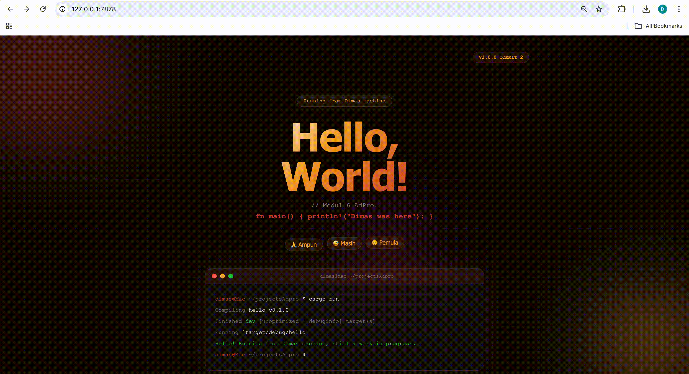

# Refleksi Tutorial 6

Commit 1 Reflection Notes

Menurut saya pemisahan `handle_connection` dari `main` itu penting karena bikin tugas masing-masing fungsi jadi jelas. `main` sekarang cuma fokus nerima koneksi baru, sedangkan parsing request dipindah ke tempat yang lebih cocok. Waktu saya lihat isi request pakai `BufReader`, saya jadi lebih paham kalau browser ternyata ngirim banyak header, bukan cuma path. Bagian `take_while(|line| !line.is_empty())` juga masuk akal karena HTTP request header memang berhenti di baris kosong. Dari sini saya belajar kalau baca request mentah dulu itu membantu buat ngerti alur sebelum lanjut bikin response. Jadi meskipun server ini belum mengembalikan HTML, tahap ini penting buat ngebuktiin kalau koneksi dan parsing request-nya sudah jalan.

Commit 2 Reflection Notes

Di tahap ini server akhirnya mengirim response yang benar ke browser, jadi hasilnya tidak lagi kosong seperti sebelumnya. Saya baru sadar kalau browser butuh format HTTP response yang rapi, terutama status line, header `Content-Length`, lalu baru isi HTML-nya. Bagian `fs::read_to_string("hello.html")` bikin kontennya lebih enak diatur karena HTML dipisah dari kode Rust. Menurut saya ini lebih bersih dibanding nulis seluruh HTML langsung di string panjang di dalam fungsi. Dari sini saya juga paham kenapa panjang konten harus dihitung dulu, karena browser perlu tahu kapan response selesai dibaca. Intinya, milestone ini menunjukkan bahwa server bukan cuma menerima request, tapi juga sudah bisa mengembalikan halaman HTML sederhana dengan format response yang valid.

Commit 3 Reflection Notes

Di commit ini saya mulai validasi request line supaya server tidak selalu mengirim halaman yang sama untuk semua path. Sekarang saya ambil baris pertama request saja, lalu saya cocokkan apakah path yang diminta itu `/` atau bukan. Kalau cocok, server balikin `hello.html`, dan kalau tidak, server balikin `404.html` dengan status `404 NOT FOUND`. Menurut saya refactor ke bentuk `let (status_line, filename) = ...` itu penting karena logika pemilihan response jadi lebih ringkas dan tidak bikin duplikasi saat baca file lalu menyusun response HTTP. Sebelumnya alurnya terasa terlalu kaku karena semua request diperlakukan sama, padahal semestinya server bisa membedakan halaman valid dan halaman yang tidak ada. Dari milestone ini saya jadi lebih paham bahwa pemisahan antara penentuan response dan proses menulis response ke stream bikin kode lebih gampang dibaca dan lebih enak dikembangkan ke tahap berikutnya.

Demo tampilan commit 3:

Commit 4 Reflection Notes

Di tahap ini saya tambahkan route `/sleep` yang sengaja menunda response selama 10 detik supaya efek server single-threaded bisa kelihatan. Secara fungsi, route ini memang sederhana karena tetap mengembalikan `hello.html`, tapi ada `thread::sleep(Duration::from_secs(10))` sebelum response dikirim. Justru bagian itu yang penting, karena dari sini kelihatan kalau satu request lambat bisa bikin request lain ikut nunggu. Waktu saya pahami alurnya, masuk akal kenapa ini terjadi: server sekarang masih memproses koneksi satu per satu di thread utama, jadi belum ada mekanisme buat menangani beberapa request sekaligus. Menurut saya milestone ini penting bukan karena fiturnya rumit, tapi karena dia menunjukkan bottleneck yang nyata dan jadi alasan kuat kenapa nanti perlu thread pool. Jadi sebelum masuk ke multithreading, saya sekarang lebih paham dulu masalah yang mau diselesaikan itu sebenarnya apa.

Commit 5 Reflection Notes

Di milestone ini bottleneck dari commit sebelumnya akhirnya ditangani dengan `ThreadPool`, jadi server tidak lagi memproses semua request di satu alur yang sama. Menurut saya bagian paling penting bukan cuma menambah thread, tapi membatasi jumlah thread lewat pool supaya server tetap punya kontrol dan tidak asal membuat thread baru untuk setiap koneksi. Waktu saya lihat strukturnya, saya jadi lebih paham kalau `execute` itu sebenarnya cuma mengirim job ke channel, lalu worker yang standby akan ambil dan menjalankannya. Dengan cara ini, request `/sleep` bisa ditangani oleh satu worker, sementara request biasa tetap bisa dikerjakan worker lain tanpa harus ikut menunggu 10 detik. Saya juga baru lebih kebayang kenapa `Arc<Mutex<Receiver<_>>>` dipakai, yaitu karena receiver-nya perlu dibagi ke banyak worker tapi tetap aman saat diakses bergantian. Jadi dibanding milestone 4, sekarang server terasa lebih masuk akal untuk menangani beberapa request sekaligus walaupun implementasinya masih sederhana.

Commit Bonus Reflection Notes

Di bonus ini saya ganti constructor `ThreadPool` dari `new` menjadi `build`, lalu saya pakai `Result` sebagai cara memberi tahu kalau input size tidak valid. Menurut saya ini lebih baik dibanding versi `new` sebelumnya karena `new` langsung panic saat size `0`, sedangkan `build` memberi kesempatan ke caller buat menangani error dengan lebih rapi. Secara perilaku, dua fungsi ini sama-sama dipakai untuk membuat thread pool, tapi pendekatannya beda: `new` cocok kalau kita yakin input selalu valid, sementara `build` lebih aman kalau kita mau desain API yang lebih defensif. Saya juga jadi lebih sadar bahwa perubahan kecil di level constructor bisa berpengaruh ke kualitas API secara keseluruhan, bukan cuma ke compile success. Dengan `build`, niat fungsi juga terasa lebih jelas karena proses pembuatan objek sekarang memang bisa gagal dan hal itu dinyatakan langsung di return type. Menurut saya ini versi yang lebih enak dipakai dan lebih masuk akal kalau proyeknya nanti berkembang.

